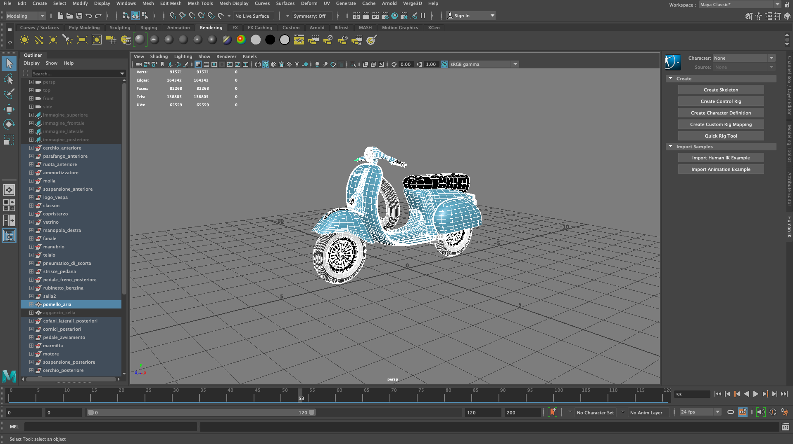

# Configuratore Vespa - Secondo progetto di Interactive 3D Graphics

### Studente:
- Luca Andaloro - 151316

## Descrizione:

L'intero progetto si basa, come da consegna, nel progettare e realizzare un configuratore per un prodotto a propria scelta. 
L'idea è stata quella di creare un configuratore per una vespa Piaggio, utilizzando un modello 3D interamente sviluppato per il progetto di Grafica 3D creativa. 
Tramite il pannello laterale è possibile cambiare diversi componenti della vespa, in particolare:
- Scocca
- Manopole
- Sella

E' possibile cambiare l'ambientazione dello sfondo, scegliendo tra:

- Studio
- Garage
- Giardino

Inoltre, è possibile:

- Abilitare una luce ambientale
- Mostrare la posizione della luce principale

## Modello:

Il modello è stato interamente autocostruito durante il corso di Grafica 3D creativa e migliorato/personalizzato per questo progetto. 
E' composto da molte parti diverse, inizialamente questo ha portato a un sovvracaricamento di gestione/creazione dei materiali, ma con lo svilupparsi del progetto il problema si è trasformato in un aspetto positivo perchè così facendo si ha la possibilità di personalizzare in molti aspetti il prodotto.
  
Dopo diversi test il modello è stato esportato e importato nella scena nel formato gltf tramite un plugin extra di Maya, [Verge3D](https://github.com/Interactive3DGraphicsCourse-UNIUD-2020/cubes-lucaandaloro/tree/sviluppo#ottimizzazione)

## Materiali:

All'interno del progetto sono state implementati cinque diversi shader, che vengono sfruttati in base al materiale selezionato dell'utente, e sono: 

- Reflection mapping con Cubemap
- Textures con Diffuse, Normal, Roughness e Specular
- Textures con Diffuse, Normal, Roughness, Specular e Ambient occlusion
- Microfacets per il metalli (scocca) con colore
- Irradiance Map per illuminari i cerchi quando non si ha attiva nessuna cubeMap

Inoltre sono stati creati alcuni materiali senza shaders per le parti che non possono essere personalizzate dell'utente, come per esempio i vetrini del fanale anteriore e posteriore.

## Luci:

Le luci che illuminano "artificalmente" l'oggetto inserite sono 5:

- 1 luce principale che viene utilizzate all'interno delle BRDF textures e Microfacets (quella vista nei nostri esempi)
- 1 luce spotlight che viene utilizzate all'interno delle BRDF Microfacets (insieme alla luce principale)
- 2 luci spotlight che vengono utilizzate nell'ambiente Studio per illuminarlo, creare le ombre e dare un effetto set fotografico
- 1 Luce ambientlight che può essere abilitata e disabilitata dell'utente e agisce sull'illuminazione della Texture "ruggine" tramite l'utilizzo dell'Ambient occlusion ed aggiunge un'illuminazione all'ambiente.

Invece la tecnica utilizzata per illuminare "naturalmente" l'oggetto sono:

- L'utillizzo delle Envoriment Maps con ambientazione per la parte di Glossy
- Invece per la parte dell'ambiente Studio viene utilizzata una Irradince Map che illumina alcuni particolare riflettenti (come per esempio la cornice laterale e i cerchi)

Sono state inserite molte combinazioni luci diverse solo a scopo didattico per mostrare le diverse applicazioni.

## Ambienti:

Per la parte degli ambienti durante lo sviluppo del progetto sono state effettuate diverse prove per trovare l'ambientazione giusta, l'idea era quella di posizionare la vespa in un studio fotografico o salone di esposizione.
Infine sono state scelte tre ambientazioni diverse:

- Studio: è stato creato uno studio "artificale" trammite un cubo viene ricreata la stanza e un piano il pavimento di appoggio
- Garage: utilizzando le cubemaps è stato creato un ambiente stile di garage
- Giardino: utilizzando sempre le cubemaps è stato creata una ambientazione in un giardino 

## Sviluppi futuri:

Il progetto potrebbe essere ampliato aggiungendo nuove personalizzazioni per altri componenti, come per esempio la possibilità di personalizzare i cerchi, le gomme, aggiungere colori etc...

## Struttura:

* `./README.md` -> File che si sta consultando e contiene una breve descrizione del progetto
* `./index.html` -> Homepage del sito web
* `./configuratore.html` ->  File  del configuratore, contiente tutti Shaders
* `./journal.md` -> Diario giornaliero dei lavori e test svolti
* **`./js`** -> Contiene tutti i file js del progetto
  * `./js/main.js` ->  File principale dove vengono richiamate tutte le funzioni per la creazione degli elementi
  * `./js/modello.js` -> Carica l'intero modello 3D, suddivide le varie parti e assegna i materiali
  * `./js/cambiaAmbiente.js` -> Contiene la funzione per cambiare la environment map
  * `./js/cambiaManopola.js` -> Contiene la funzione per cambiare i materiali della manopola
  * `./js/cambiaScocca.js` -> Contiene la funzione per cambiare i materiali della scocca
  * `./js/cambiaSella.js` -> Contiene la funzione per cambiare i materiali della sella
  * `./js/materiali.js` -> Contiene tutti i materiali di tutto il progetto che vengono richiesti tramite la funzione `getMateriale()`
  * `./js/luceAmbientale.js` -> Contiene la funzione attivare la luce ambientale
  * `./js/mostraPosizioneLuce.js` -> Contiene la funzione mostrare la posizione della luce principale
* **`./textures`** -> Contiene tutte le texture utilizzate nel progetto (Sia le cubemaps, che le varie textures)
* **`./modello_3d`** -> Contiene i file `.bin` e `.gltf` del modello 3D
* **`./images`** -> Contiene tutti i file multimediali del progetto, sia per la parte del sito web sia per il file readme.md
* **`./css`** -> Contiene i file di stile del sito web

## Strumenti Utilizzati
- **Software**
  - Maya
  - VS Code
  - Safari
  - Photoshop
  - GitHub Desktop
  - [Pixplant 3](https://www.pixplant.com) -> Ho utilizzato questo programma per crearmi la texture AO Map per la ruggine perchè non veniva fornita.
  

- **Hardware:**
  - Portatile: MacBook Pro (15-inch, 2018)
  - CPU: 2,6 GHz Intel Core i7 6 core
  - Scheda grafica: Radeon Pro 560X 4 GB / Intel UHD Graphics 630 1536 MB
  - RAM: 16 GB 2400 MHz DDR4

- **Framework:**
  - [Ulkit](https://getuikit.com)
 

## Credits

- **Textures**
  - [cc0textures](https://www.cc0textures.com)
  - [textures.com](https://www.textures.com)

- **Cubemaps:**
  - [humus](http://www.humus.name/)
  - [hdrihaven](https://hdrihaven.com)
